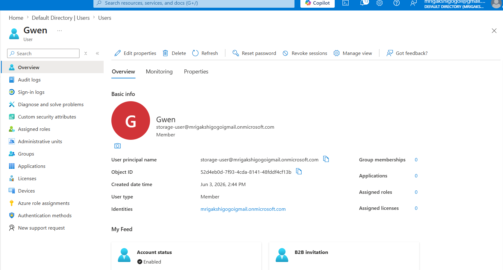
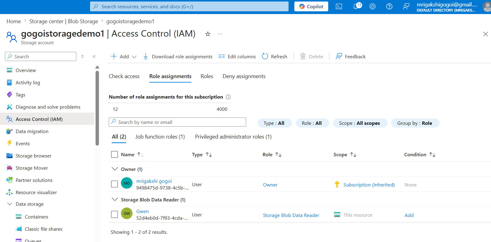
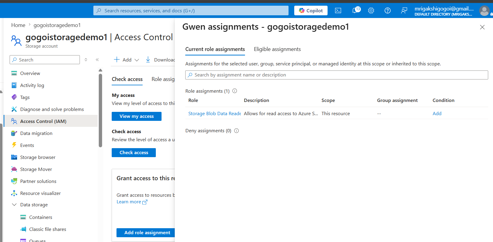

# AZ-104 Lab: Azure Storage Account and Blob Storage

## Project Overview

This lab demonstrates how to create and manage Azure Storage resources in Microsoft Azure. The project covers Storage Account creation, Blob Containers, file uploads, Shared Access Signatures (SAS), and Lifecycle Management.

---

## Architecture
 
Resource Group
     →
Storage Account
     →
Blob Container
     →
Uploaded Files

---

## Step 1: Create a Resource Group

A Resource Group was created to organize all resources used in this lab.

### Screenshot

### Key Learning

- Resource organization
- Simplified resource management
- Easier cleanup of Azure resources

---

## Step 2: Create a Storage Account

A Storage Account was created using Standard Performance and Locally Redundant Storage (LRS).

### Screenshot

### Key Learning

- Azure Storage Account deployment
- Redundancy options
- Storage performance tiers

---

## Step 3: Review Storage Account Configuration

Verified account settings, region, performance tier, and replication settings.

### Screenshot

### Key Learning

- Storage Account properties
- Replication configuration
- Resource monitoring

---

## Step 4: Create a Blob Container

A Blob Container was created to store files and unstructured data.

### Screenshot

### Key Learning

- Blob Storage concepts
- Container access levels
- Data organization

---

## Step 5: Upload Files to Blob Storage

Files were uploaded to validate storage functionality.

### Screenshot

### Key Learning

- File upload management
- Cloud storage operations
- Blob management

---

## Step 6: Generate a SAS Token

A Shared Access Signature (SAS) was generated to provide secure, temporary access to storage resources.

### Screenshot

### Key Learning

- Secure delegated access
- Temporary permissions
- Storage security best practices

---

## Step 7: Configure Lifecycle Management

A lifecycle management policy was created to automatically move older blobs to a lower-cost storage tier.

### Screenshot

### Key Learning

- Cost optimization
- Automated storage management
- Data lifecycle governance

---

## Step 8: Create a Test User in Microsoft Entra ID

A test user account was created in Microsoft Entra ID to simulate role-based access management scenarios.

### User Details

| User | Purpose |
|--------|---------|
| storage.user | Read-only access to Blob Storage |

### Screenshot

### Key Learning

- Microsoft Entra ID user management
- Identity administration
- User provisioning

---

## Step 9: Assign RBAC Role

The built-in Azure role **Storage Blob Data Reader** was assigned to the test user using Azure Role-Based Access Control (RBAC).

### Screenshot

### Key Learning

- Azure RBAC
- Principle of Least Privilege
- Access management

---

## Step 10: Verify Permissions

Access permissions were reviewed to confirm that the user received read-only access to Blob Storage resources.

### Access Matrix

| User | Access Level |
|--------|-------------|
| Administrator | Full Access |
| storage.user | Read Only |

### Screenshot

### Key Learning

- Permission validation
- Secure access control
- Enterprise security practices

---

## Skills Demonstrated

- Azure Storage Accounts
- Azure Blob Storage
- Shared Access Signatures (SAS)
- Lifecycle Management
- Microsoft Entra ID
- Azure Role-Based Access Control (RBAC)
- Identity and Access Management (IAM)
- Storage Security
- Azure Administration

---

## Conclusion

Successfully deployed and configured Azure Storage services, created and managed Blob Containers, uploaded and organized data, implemented secure access using Shared Access Signatures (SAS), and configured Lifecycle Management policies to optimize storage costs.

In addition, Microsoft Entra ID and Azure Role-Based Access Control (RBAC) were used to demonstrate secure identity and access management by assigning least-privilege permissions to a test user. This reflects real-world enterprise practices for protecting cloud resources and controlling access to sensitive data.

This lab demonstrates practical Azure Administrator (AZ-104) skills related to cloud storage management, security, governance, identity management, and cost optimization. Through this project, I gained hands-on experience with Azure Storage Accounts, Blob Storage, access control, lifecycle policies, and administrative tasks commonly performed in production Azure environments.

Overall, this lab showcases the ability to deploy, secure, manage, and optimize Azure storage resources while following industry best practices for security and operational efficiency.
