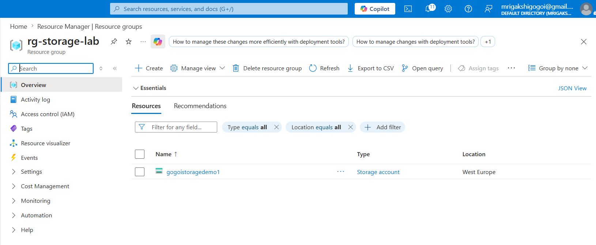
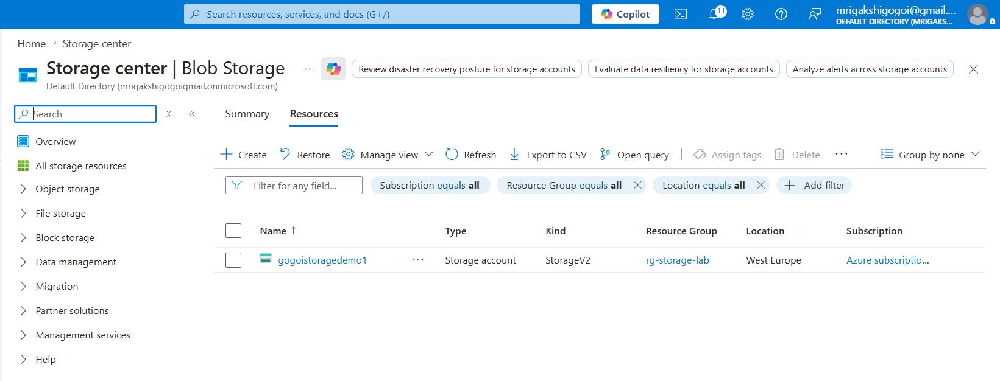
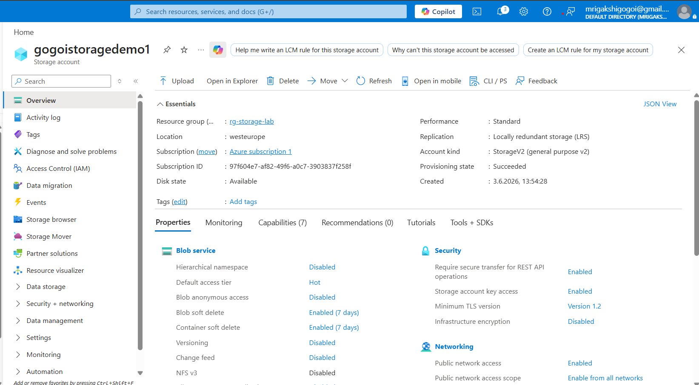
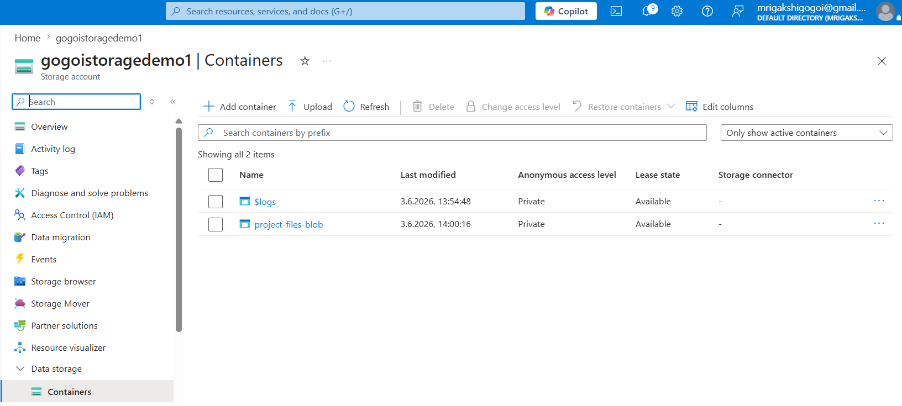
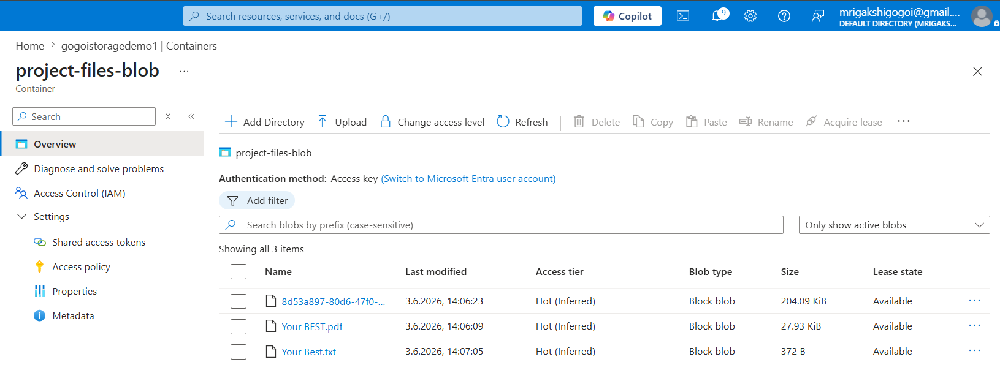
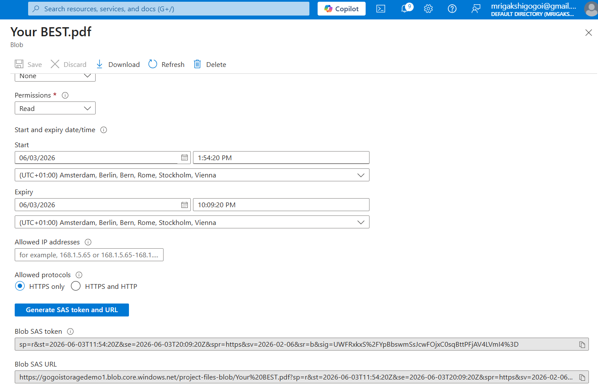
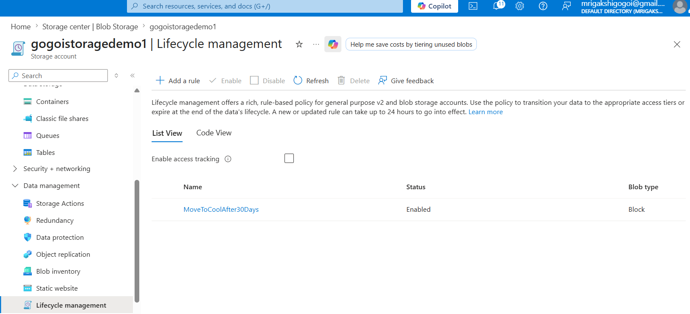

# AZ-104 Lab: Azure Storage Account and Blob Storage

## Project Overview

This lab demonstrates how to create and manage Azure Storage resources in Microsoft Azure. The project covers Storage Account creation, Blob Containers, file uploads, Shared Access Signatures (SAS), and Lifecycle Management.

---

## Architecture
 
Resource Group
     →
Storage Account
     →
Blob Container
     →
Uploaded Files

---

## Step 1: Create a Resource Group

A Resource Group was created to organize all resources used in this lab.

### Screenshot

### Key Learning

- Resource organization
- Simplified resource management
- Easier cleanup of Azure resources

---

## Step 2: Create a Storage Account

A Storage Account was created using Standard Performance and Locally Redundant Storage (LRS).

### Screenshot

### Key Learning

- Azure Storage Account deployment
- Redundancy options
- Storage performance tiers

---

## Step 3: Review Storage Account Configuration

Verified account settings, region, performance tier, and replication settings.

### Screenshot

### Key Learning

- Storage Account properties
- Replication configuration
- Resource monitoring

---

## Step 4: Create a Blob Container

A Blob Container was created to store files and unstructured data.

### Screenshot

### Key Learning

- Blob Storage concepts
- Container access levels
- Data organization

---

## Step 5: Upload Files to Blob Storage

Files were uploaded to validate storage functionality.

### Screenshot

### Key Learning

- File upload management
- Cloud storage operations
- Blob management

---

## Step 6: Generate a SAS Token

A Shared Access Signature (SAS) was generated to provide secure, temporary access to storage resources.

### Screenshot

### Key Learning

- Secure delegated access
- Temporary permissions
- Storage security best practices

---

## Step 7: Configure Lifecycle Management

A lifecycle management policy was created to automatically move older blobs to a lower-cost storage tier.

### Screenshot

### Key Learning

- Cost optimization
- Automated storage management
- Data lifecycle governance

---

## Skills Demonstrated

- Azure Resource Groups
- Azure Storage Accounts
- Azure Blob Storage
- Shared Access Signatures (SAS)
- Lifecycle Management
- Cloud Storage Administration
- Azure Administration

---

## Conclusion

Successfully deployed and configured Azure Storage services, uploaded and managed files, implemented secure access using SAS tokens, and configured lifecycle management policies to optimize storage costs.

This lab demonstrates practical Azure Administrator (AZ-104) skills related to cloud storage management, security, and governance.
